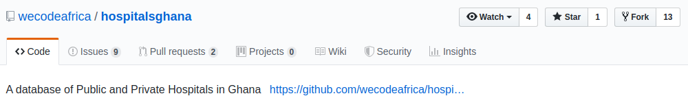
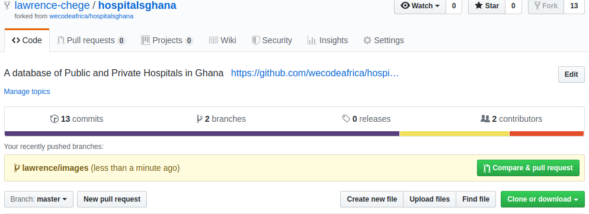
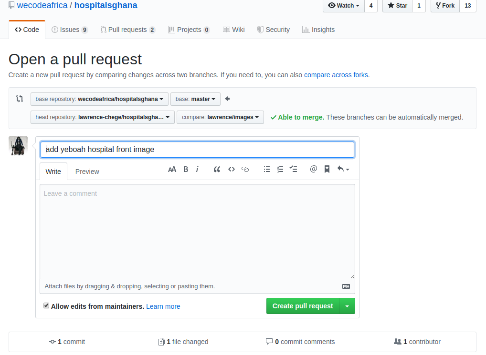

# CONTRIBUTING GUIDE

## *STEP ONE*

- Make a fork of this repo on your git hub


## *STEP TWO*

- Clone the repo on your computer
`git clone https://github.com/wecodeafrica/hospitalsghana.git` 
- or if you use ssh
`git clone git@github.com:wecodeafrica/hospitalsghana.git`

## *STEP THREE*

- Go into the app folder
`cd hospitalsghana`

## *STEP FOUR*

- add the remote upstream to connect to the main repo `git remote add upstream https://github.com/wecodeafrica/hospitalsghana.git`
- or for ssh `git remote add upstream git clone git@github.com:wecodeafrica/hospitalsghana.git`
- now you have two remotes on your local computer : origin and upstream

## *STEP FIVE*

- make sure you are on master branch
`git checkout master`

- Get the current version of both on the main repo and push to your forked 
`git pull upstream master && git push origin master`

- Create a new branch to work on. Name this in a precise manner. I prefer name\feature;
`git checkout -b lawrence\update-readme`

## *STEP SIX*

- Do some work and stage to git
_git add file you changed_

- In this case
`git add README.md`

- Commit the work you staged to git to save it permanently
_git commit -m "message of what you did"_

- In this case
`git commit -m "update contributing part of README.md`

- Push the new branch to the remote repo on github
_git push -u origin branch you created_

- in this case
`git push -u origin lawrence\update-readme`

## *STEP SEVEN*

- Create a pull request
- This is for asking for your changes to be included in the main repo
- Go to your github ... to the repo you forked



- Click on the compare and pull request.



- To create a pull request . Use markdown symbols as used below

```md
# Title of what you did
## subtitle or short description
- To make points
- More points
# Screenshots
- drag and drop images to show the outputs of your changes
- this makes it easier to verify your changes
```

## *STEP EIGHT*

- sit , relax , and wait for your pull request to be accepted.
- You did good.

## Maintainers

- [**Andrew Miracle**](https://github.com/koolamusic)
- [**Eugene Adortsu**](https://github.com/eadortsu)