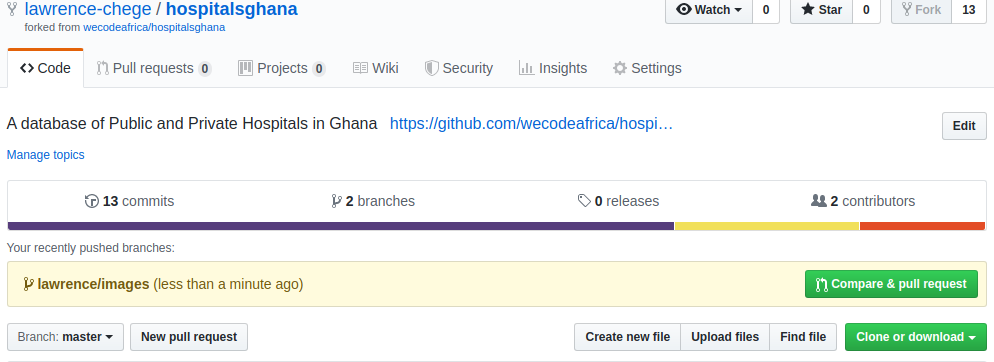

# Hospitals in Ghana
[](#contributors)

A Progressive Web App publishing a database of Public and Private Hospitals in Accra
[hospitalsinghana.com](https://github.com/wecodeafrica/hospitalsghanas).

## Getting Started

Styles are written in SCSS and compiled locally. Follow the instructions below to set up the project on your local machine for development and testing purposes. 

### Prerequisites
[Node.js](https://nodejs.org/)


### Running this project locally
- Clone the project to your computer using `git clone https://github.com/wecodeafrica/hospitalsghana`

- To view the site locally run `npx serve .`
If you're making any style changes, you need to compile the SCSS. Here's how to do this:

- Install dependencies with `npm install`.
- Run `npm run build` to build/generate CSS files. You can also use `npm run scss` for real-time compilation.


## Contributing

To learn more about contributing to this project by reading the contribution guide.
*STEP ONE*
- Make a fork of this repo on your git hub


*STEP TWO*
- Clone the repo on your computer
`git clone https://github.com/wecodeafrica/hospitalsghana.git` 
- or if you use ssh
`git clone git@github.com:wecodeafrica/hospitalsghana.git`

*STEP THREE*
- Go into the app folder
`cd hospitalsghana`

*STEP FOUR*
- add the remote upstream to connect to the main repo
` git remote add upstream https://github.com/wecodeafrica/hospitalsghana.git `
- or for ssh
` git remote add upstream git clone git@github.com:wecodeafrica/hospitalsghana.git`

- now you have two remotes on your local computer : origin and upstream
*STEP FOUR*
- make sure you are on master branch
`git checkout master`
- Get the current version of both on the main repo and push to your forked 
`git pull upstream master && git push origin master`
- Create a new branch to work on. Name this in a precise manner. I prefer name\feature;
`git checkout -b lawrence\update-readme`

*STEP FIVE*
- Do some work and stage to git
_git add file you changed_
- In this case
`git add README.md`
- Commit the work you staged to git to save it permanently
_git commit -m "message of what you did"_
- In this case
`git commit -m "update contributing part of README.md`
- Push the new branch to the remote repo on github
_git push -u origin branch you created_
- in this case
`git push -u origin lawrence\update-readme`

*STEP SIX*
- Create a pull request
- This is for asking for your changes to be included in the main repo
- Go to your github ... to the repo you forked

- Click oin the compare and pull request.

- To create a pull request . Use markdown symbols as used below
```
# Title of what you did
## subtitle or short description
- To make points
- More points
# Screenshots
- drag and drop images to show the outputs of your changes
- this makes it easier to verify your changes

```
*STEP SEVEN*
- sit , relax , and wait for your pull request to be accepted.
- You did good.


## Authors

* [**Andrew Miracle**](https://github.com/koolamusic)
* [**Eugene Adortsu**](https://github.com/eadortsu) 
## Contributors ✨

Thanks goes to these wonderful people ([emoji key](https://allcontributors.org/docs/en/emoji-key)):

<!-- ALL-CONTRIBUTORS-LIST:START - Do not remove or modify this section -->
<!-- prettier-ignore -->
<table>
  <tr>
    <td align="center"><a href="https://github.com/mickeymond"><br /><sub><b>Michael Hammond</b></sub></a><br /><a href="https://github.com/wecodeafrica/hospitalsghana/commits?author=mickeymond" title="Documentation">📖</a> <a href="https://github.com/wecodeafrica/hospitalsghana/commits?author=mickeymond" title="Code">💻</a></td>
    <td align="center"><a href="https://github.com/Anillab"><br /><sub><b>Anilla Stephannie</b></sub></a><br /><a href="https://github.com/wecodeafrica/hospitalsghana/commits?author=Anillab" title="Documentation">📖</a> <a href="https://github.com/wecodeafrica/hospitalsghana/commits?author=Anillab" title="Code">💻</a></td>
    <td align="center"><a href="https://github.com/lawrence-chege"><br /><sub><b>Larry Chege</b></sub></a><br /><a href="https://github.com/wecodeafrica/hospitalsghana/commits?author=lawrence-chege" title="Documentation">📖</a> <a href="#content-lawrence-chege" title="Content">🖋</a></td>
  </tr>
</table>

<!-- ALL-CONTRIBUTORS-LIST:END -->

This project follows the [all-contributors](https://github.com/all-contributors/all-contributors) specification. Contributions of any kind welcome!